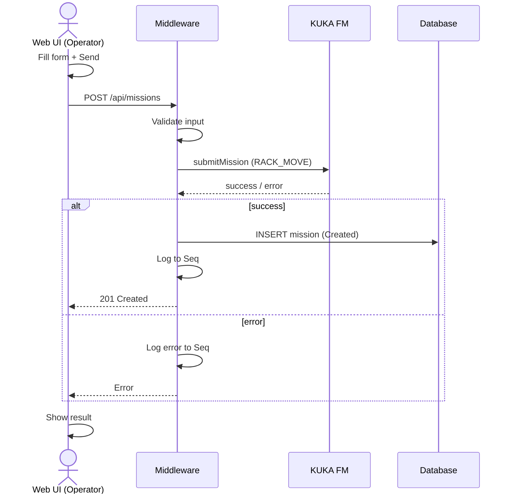

# UC1 – Dispatch mission

```mermaid
sequenceDiagram
    actor UI as Web UI (Operator)
    participant MW as Middleware
    participant KUKA as KUKA FM
    participant DB as Database

    UI->>UI: Fill form + Send
    UI->>MW: POST /api/missions
    MW->>MW: Validate input
    MW->>KUKA: submitMission (RACK_MOVE)
    KUKA-->>MW: success / error
    alt success
        MW->>DB: INSERT mission (Created)
        MW->>MW: Log to Seq
        MW-->>UI: 201 Created
    else error
        MW->>MW: Log error to Seq
        MW-->>UI: Error
    end
    UI->>UI: Show result
```
