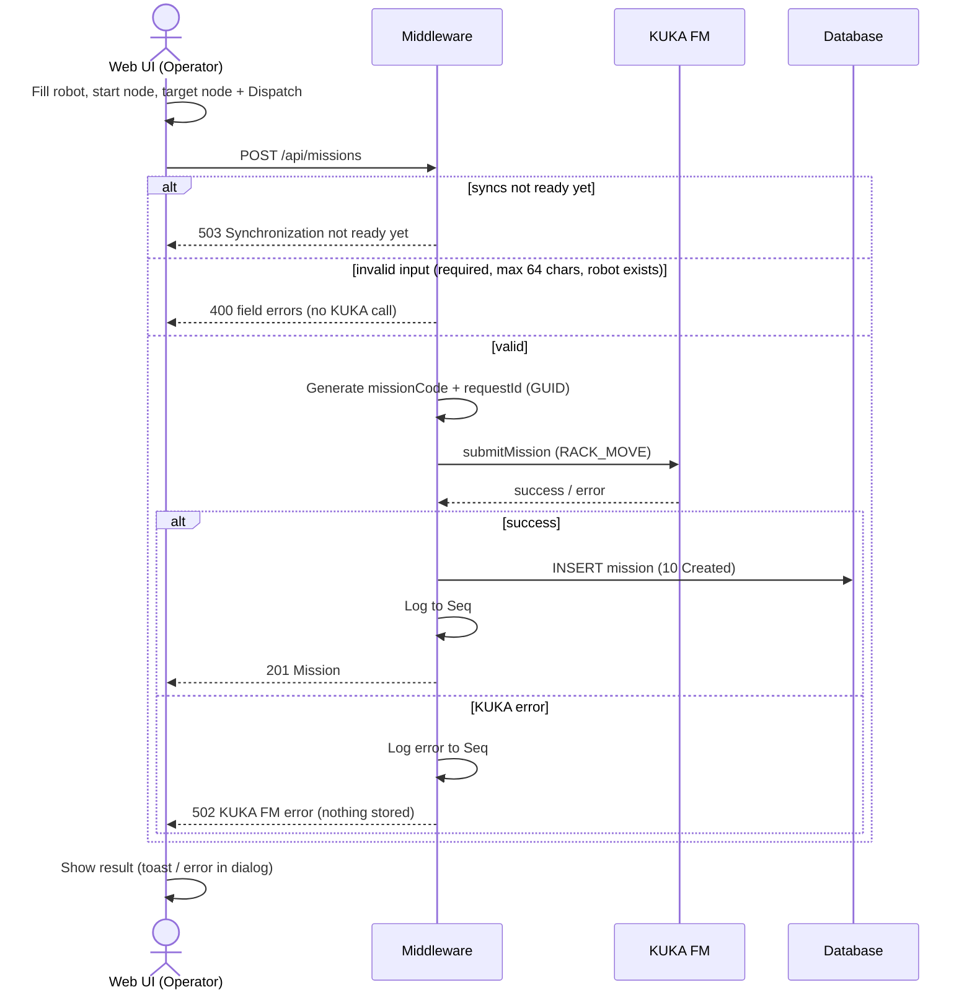

# UC1 – Dispatch mission

```mermaid
sequenceDiagram
    actor UI as Web UI (Operator)
    participant MW as Middleware
    participant KUKA as KUKA FM
    participant DB as Database

    UI->>UI: Fill robot, start node, target node + Dispatch
    UI->>MW: POST /api/missions
    alt syncs not ready yet
        MW-->>UI: 503 Synchronization not ready yet
    else invalid input (required, max 64 chars, robot exists)
        MW-->>UI: 400 field errors (no KUKA call)
    else valid
        MW->>MW: Generate missionCode + requestId (GUID)
        MW->>KUKA: submitMission (RACK_MOVE)
        KUKA-->>MW: success / error
        alt success
            MW->>DB: INSERT mission (10 Created)
            MW->>MW: Log to Seq
            MW-->>UI: 201 Mission
        else KUKA error
            MW->>MW: Log error to Seq
            MW-->>UI: 502 KUKA FM error (nothing stored)
        end
    end
    UI->>UI: Show result (toast / error in dialog)
```
