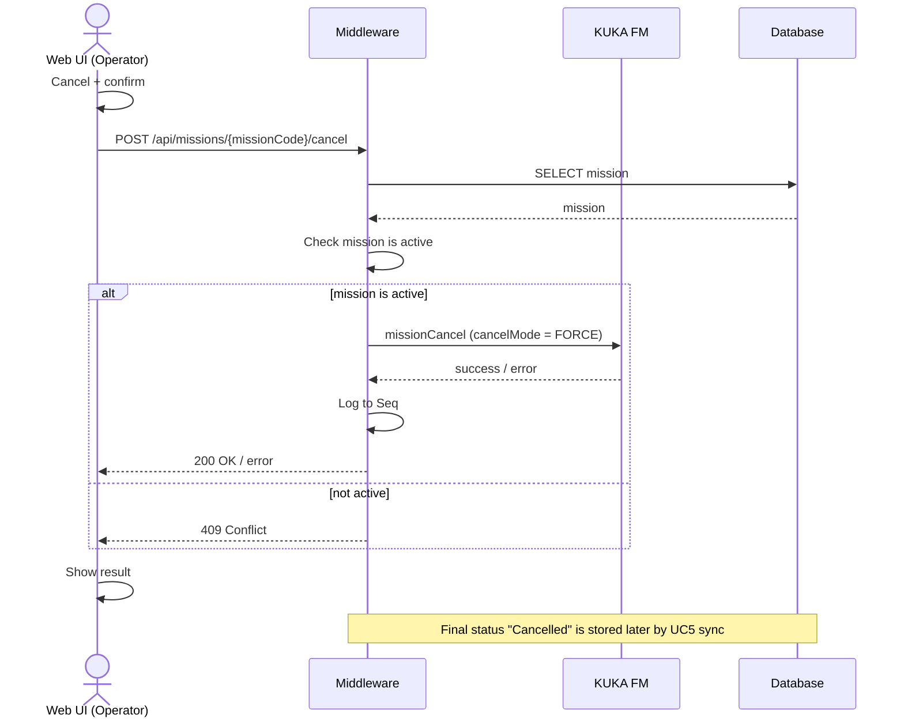

# UC2 – Cancel mission

```mermaid
sequenceDiagram
    actor UI as Web UI (Operator)
    participant MW as Middleware
    participant KUKA as KUKA FM
    participant DB as Database

    UI->>UI: Cancel + confirm
    UI->>MW: POST /api/missions/{missionCode}/cancel
    MW->>DB: SELECT mission
    DB-->>MW: mission
    MW->>MW: Check mission is active
    alt mission is active
        MW->>KUKA: missionCancel (cancelMode = FORCE)
        KUKA-->>MW: success / error
        MW->>MW: Log to Seq
        MW-->>UI: 200 OK / error
    else not active
        MW-->>UI: 409 Conflict
    end
    UI->>UI: Show result
    Note over MW,DB: Final status "Cancelled" is stored later by UC5 sync
```
