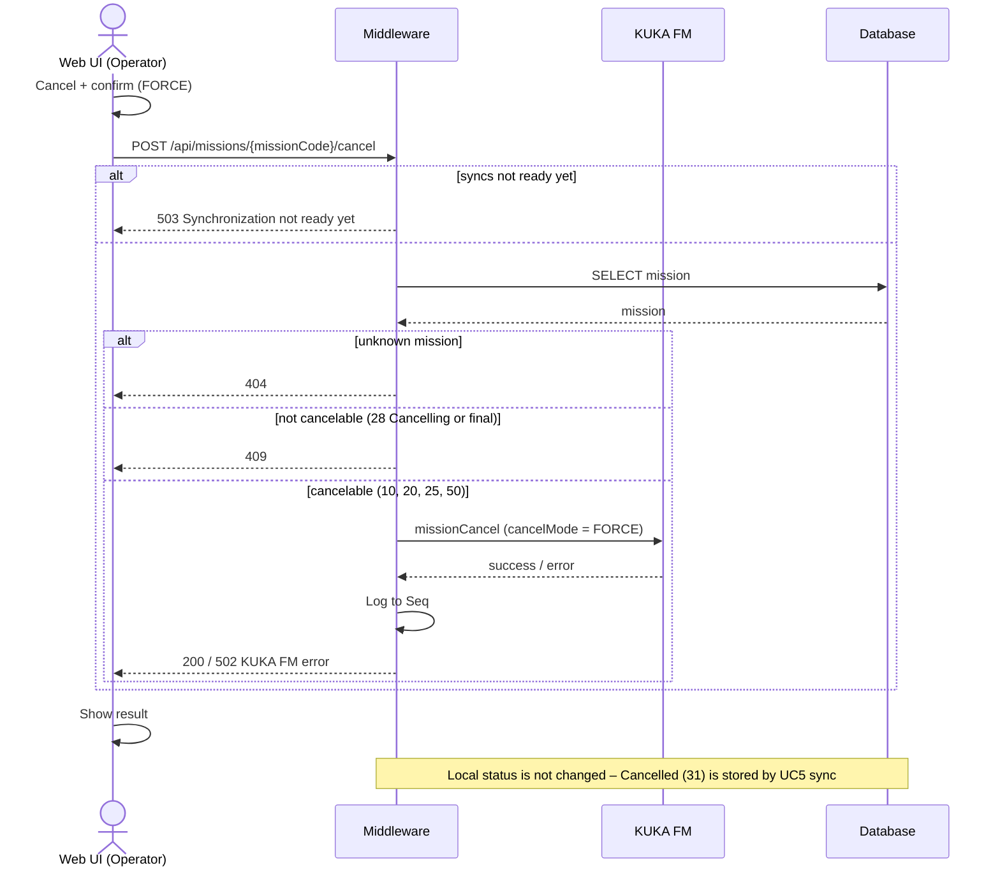

# UC2 – Cancel mission

```mermaid
sequenceDiagram
    actor UI as Web UI (Operator)
    participant MW as Middleware
    participant KUKA as KUKA FM
    participant DB as Database

    UI->>UI: Cancel + confirm (FORCE)
    UI->>MW: POST /api/missions/{missionCode}/cancel
    alt syncs not ready yet
        MW-->>UI: 503 Synchronization not ready yet
    else
        MW->>DB: SELECT mission
        DB-->>MW: mission
        alt unknown mission
            MW-->>UI: 404
        else not cancelable (28 Cancelling or final)
            MW-->>UI: 409
        else cancelable (10, 20, 25, 50)
            MW->>KUKA: missionCancel (cancelMode = FORCE)
            KUKA-->>MW: success / error
            MW->>MW: Log to Seq
            MW-->>UI: 200 / 502 KUKA FM error
        end
    end
    UI->>UI: Show result
    Note over MW,DB: Local status is not changed – Cancelled (31) is stored by UC5 sync
```
