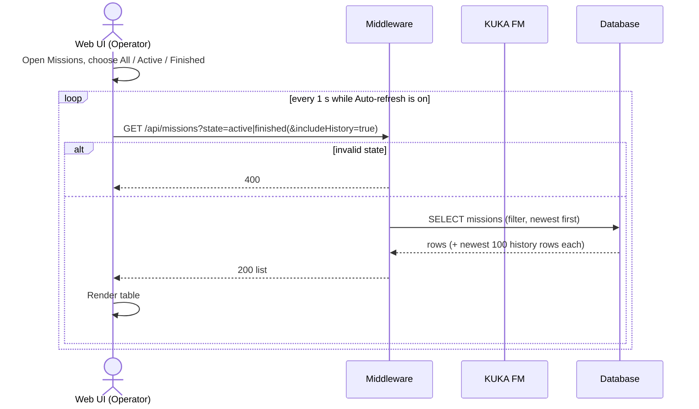

# UC3 – View mission status

```mermaid
sequenceDiagram
    actor UI as Web UI (Operator)
    participant MW as Middleware
    participant KUKA as KUKA FM
    participant DB as Database

    UI->>UI: Open Missions, choose All / Active / Finished
    loop every 1 s while Auto-refresh is on
        UI->>MW: GET /api/missions?state=active|finished(&includeHistory=true)
        alt invalid state
            MW-->>UI: 400
        else
            MW->>DB: SELECT missions (filter, newest first)
            DB-->>MW: rows (+ newest 100 history rows each)
            MW-->>UI: 200 list
            UI->>UI: Render table
        end
    end
```
