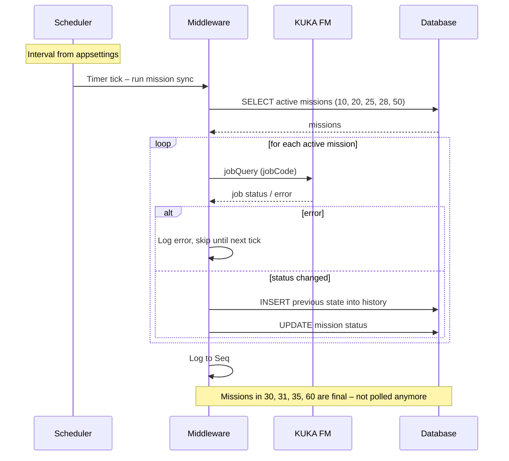

# UC5 – Synchronize mission status

```mermaid
sequenceDiagram
    participant SCH as Scheduler
    participant MW as Middleware
    participant KUKA as KUKA FM
    participant DB as Database

    Note over SCH: Interval from appsettings
    SCH->>MW: Timer tick – run mission sync
    MW->>DB: SELECT active missions (10, 20, 25, 28, 50)
    DB-->>MW: missions
    loop for each active mission
        MW->>KUKA: jobQuery (jobCode)
        KUKA-->>MW: job status / error
        alt error
            MW->>MW: Log error, skip until next tick
        else status changed
            MW->>DB: INSERT previous state into history
            MW->>DB: UPDATE mission status
        end
    end
    MW->>MW: Log to Seq
    Note over MW,DB: Missions in 30, 31, 35, 60 are final – not polled anymore
```
