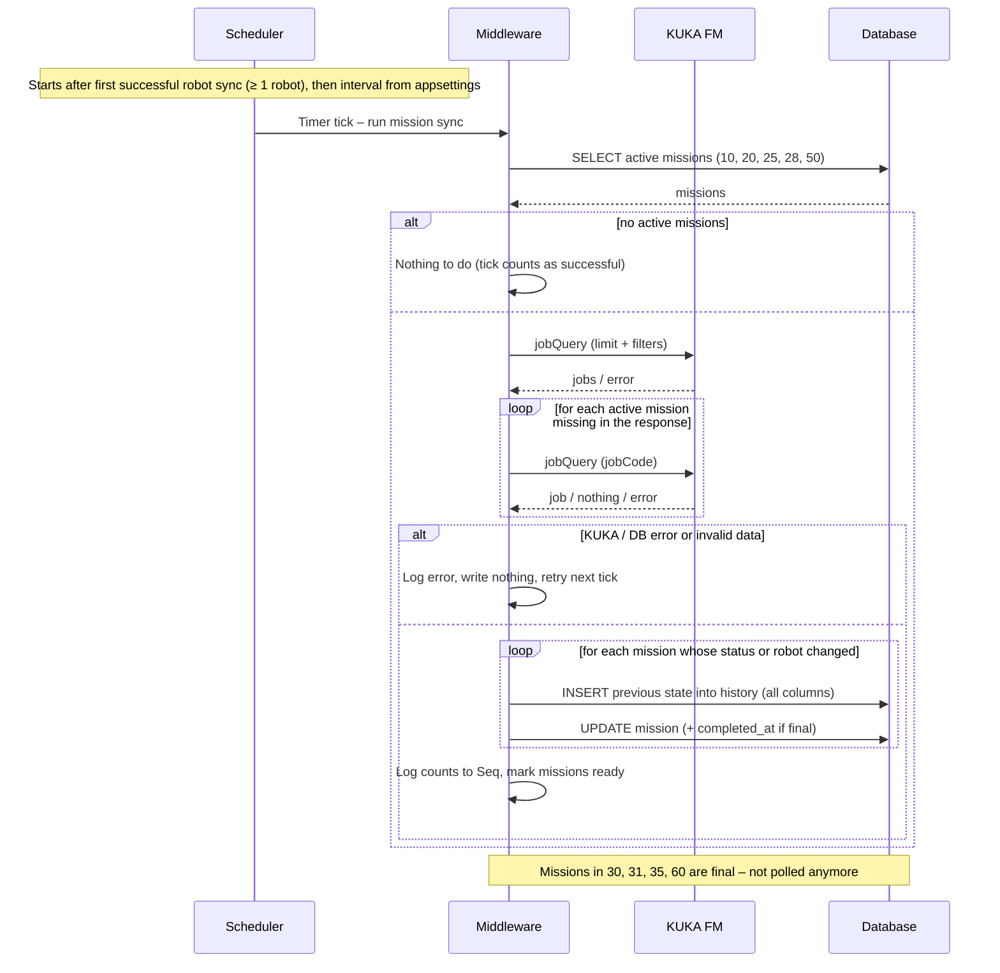

# UC5 – Synchronize mission status

```mermaid
sequenceDiagram
    participant SCH as Scheduler
    participant MW as Middleware
    participant KUKA as KUKA FM
    participant DB as Database

    Note over SCH: Starts after first successful robot sync (≥ 1 robot), then interval from appsettings
    SCH->>MW: Timer tick – run mission sync
    MW->>DB: SELECT active missions (10, 20, 25, 28, 50)
    DB-->>MW: missions
    alt no active missions
        MW->>MW: Nothing to do (tick counts as successful)
    else
        MW->>KUKA: jobQuery (limit + filters)
        KUKA-->>MW: jobs / error
        loop for each active mission missing in the response
            MW->>KUKA: jobQuery (jobCode)
            KUKA-->>MW: job / nothing / error
        end
        alt KUKA / DB error or invalid data
            MW->>MW: Log error, write nothing, retry next tick
        else
            loop for each mission whose status or robot changed
                MW->>DB: INSERT previous state into history (all columns)
                MW->>DB: UPDATE mission (+ completed_at if final)
            end
            MW->>MW: Log counts to Seq, mark missions ready
        end
    end
    Note over MW,DB: Missions in 30, 31, 35, 60 are final – not polled anymore
```
