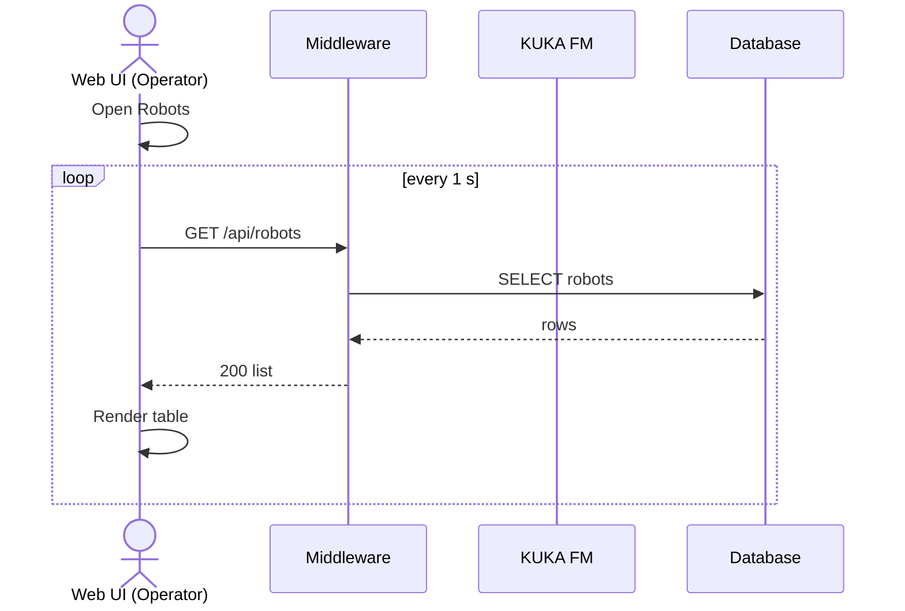

# UC6 – View robot status

```mermaid
sequenceDiagram
    actor UI as Web UI (Operator)
    participant MW as Middleware
    participant KUKA as KUKA FM
    participant DB as Database

    UI->>UI: Open Robots
    loop every 1 s
        UI->>MW: GET /api/robots
        MW->>DB: SELECT robots
        DB-->>MW: rows
        MW-->>UI: 200 list
        UI->>UI: Render table
    end
```
