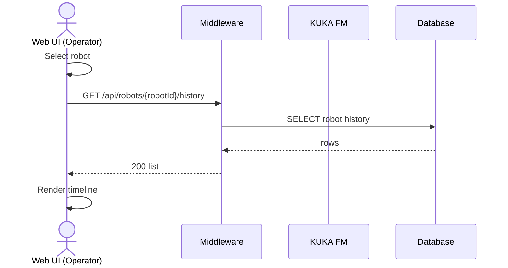

# UC7 – View robot status history (extends UC6)

```mermaid
sequenceDiagram
    actor UI as Web UI (Operator)
    participant MW as Middleware
    participant KUKA as KUKA FM
    participant DB as Database

    UI->>UI: Select robot
    UI->>MW: GET /api/robots/{robotId}/history
    MW->>DB: SELECT robot history
    DB-->>MW: rows
    MW-->>UI: 200 list
    UI->>UI: Render timeline
```
