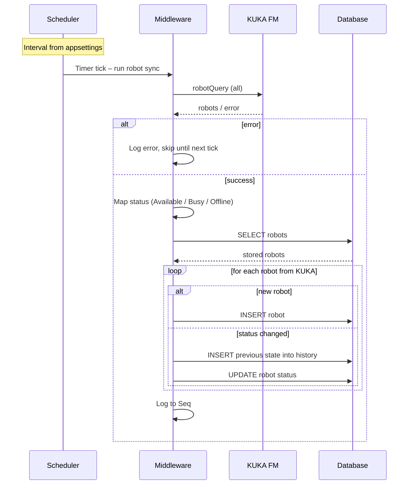

# UC8 – Synchronize robot status

```mermaid
sequenceDiagram
    participant SCH as Scheduler
    participant MW as Middleware
    participant KUKA as KUKA FM
    participant DB as Database

    Note over SCH: Interval from appsettings
    SCH->>MW: Timer tick – run robot sync
    MW->>KUKA: robotQuery (all)
    KUKA-->>MW: robots / error
    alt error
        MW->>MW: Log error, skip until next tick
    else success
        MW->>MW: Map status (Available / Busy / Offline)
        MW->>DB: SELECT robots
        DB-->>MW: stored robots
        loop for each robot from KUKA
            alt new robot
                MW->>DB: INSERT robot
            else status changed
                MW->>DB: INSERT previous state into history
                MW->>DB: UPDATE robot status
            end
        end
        MW->>MW: Log to Seq
    end
```
