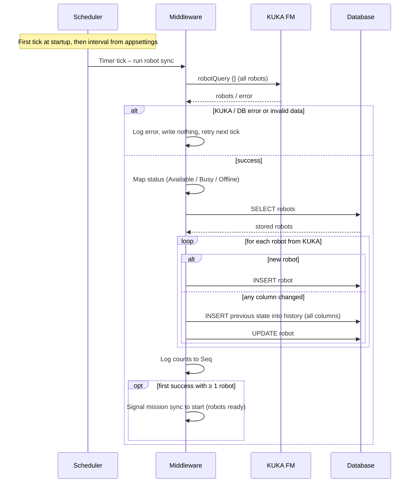

# UC8 – Synchronize robot status

```mermaid
sequenceDiagram
    participant SCH as Scheduler
    participant MW as Middleware
    participant KUKA as KUKA FM
    participant DB as Database

    Note over SCH: First tick at startup, then interval from appsettings
    SCH->>MW: Timer tick – run robot sync
    MW->>KUKA: robotQuery {} (all robots)
    KUKA-->>MW: robots / error
    alt KUKA / DB error or invalid data
        MW->>MW: Log error, write nothing, retry next tick
    else success
        MW->>MW: Map status (Available / Busy / Offline)
        MW->>DB: SELECT robots
        DB-->>MW: stored robots
        loop for each robot from KUKA
            alt new robot
                MW->>DB: INSERT robot
            else any column changed
                MW->>DB: INSERT previous state into history (all columns)
                MW->>DB: UPDATE robot
            end
        end
        MW->>MW: Log counts to Seq
        opt first success with ≥ 1 robot
            MW->>MW: Signal mission sync to start (robots ready)
        end
    end
```
